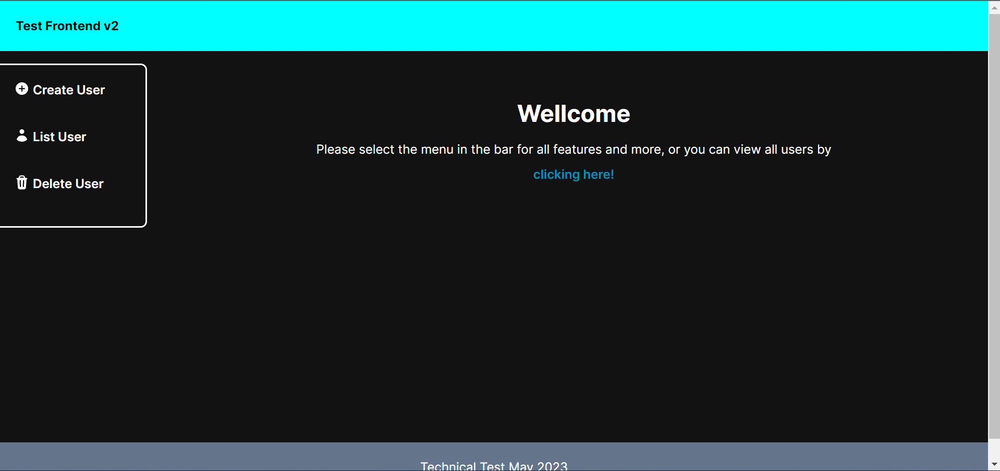
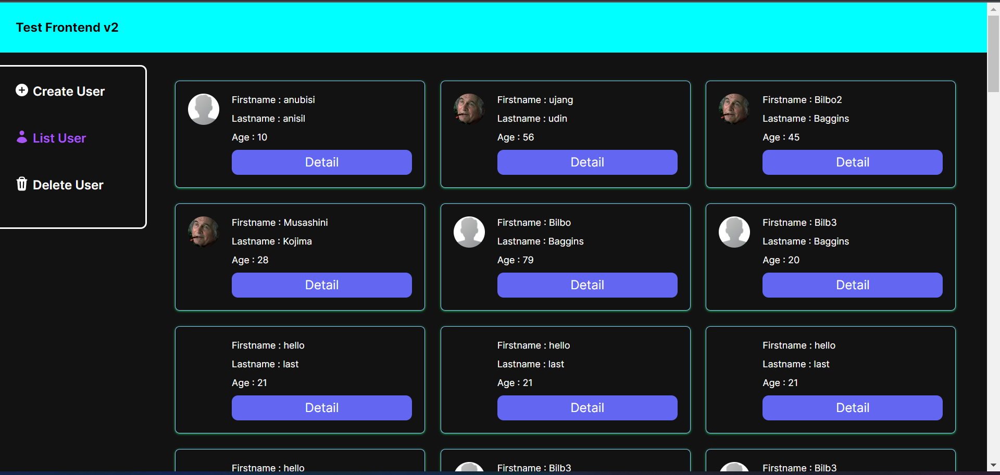
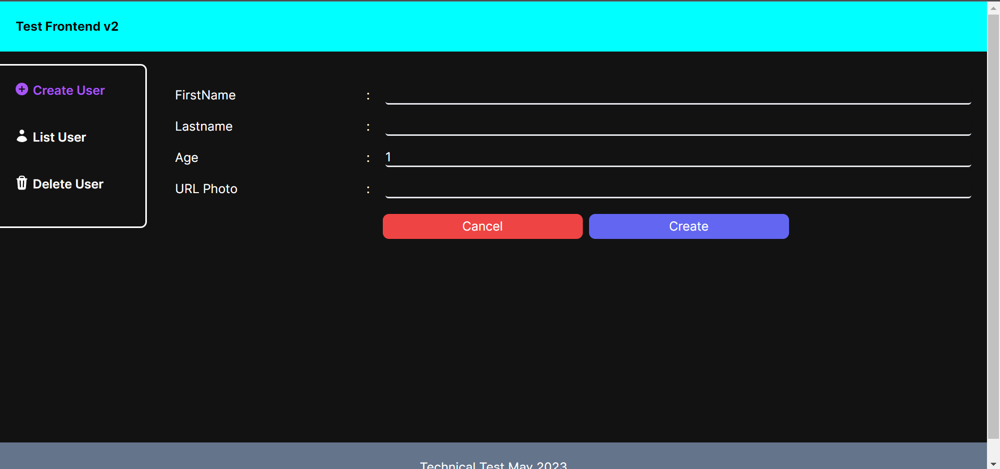
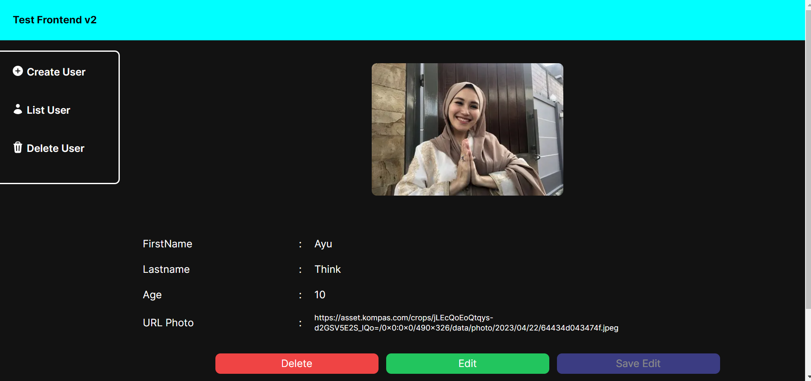
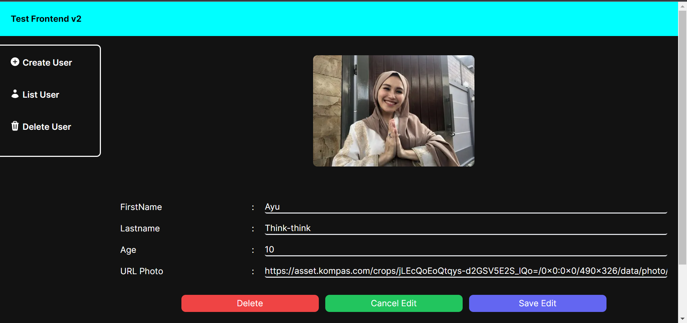
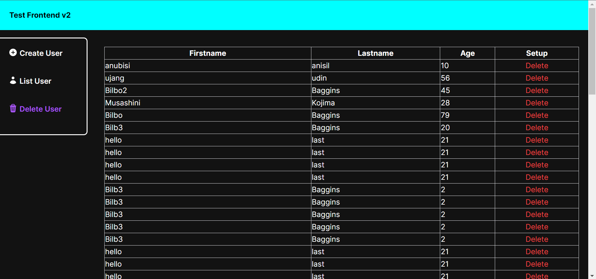

# Frontend Test V2

## How Run to Local

Install Dependencies :

```
npm install
```

Run App :

- development mode

```
npm run dev
```

- production

  a. build project/minify

  ```
  npm run build
  ```

  b. Start Project

  ```
  npm run start
  ```

Open http://localhost:3000 on

## Unit Testing

Run App :

```
npm run dev
```

Run Testing :

```
npm run cypress
```

## Screenshot

- Home
  
- Users List Page
  
- Create User Page
  
- Detail / Edit User Page
  
  
- Delete Users Page
  

# Example Deployment

waiting . . .
